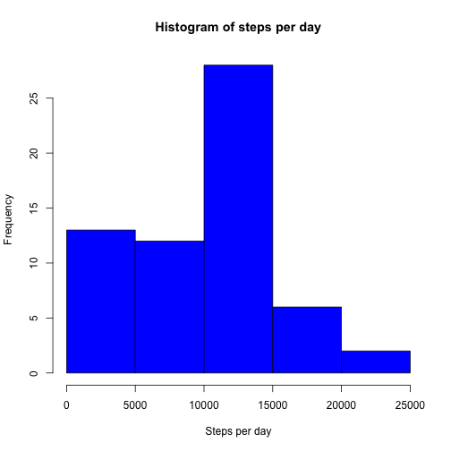
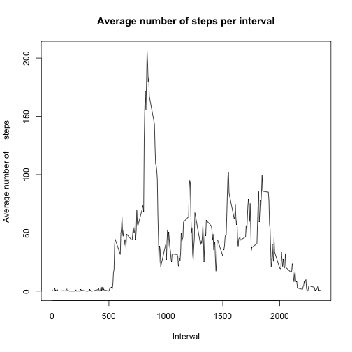
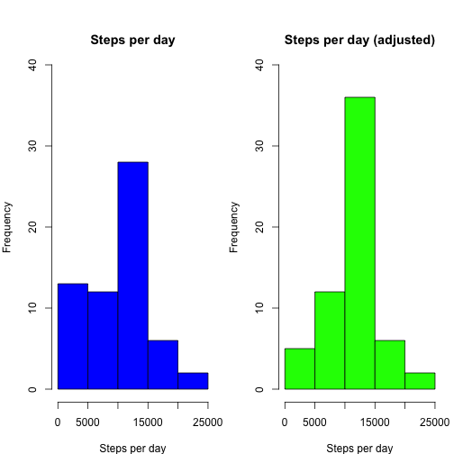
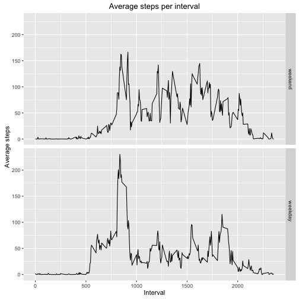

# Reproducible research course assigment for week 2  
This report is made to complete the course assigment for the Coursera course Reproducible Research of week2.  
The information presented in this report is based on the data from de file activity.csv  
  
## Code to load the data  
The following code is used to load the data from the activity.csv file. For the code to work, please set the working directory to the path of the directory where the file is contained.  

```r
stepData<-read.csv("activity.csv")
```
##What is mean total number of steps taken per day?
To calculate the total number of steps taken per day first create an array with the sum of steps taken each day.   

```r
    stepsperDay<-tapply(stepData$steps,stepData$date,sum,na.rm=TRUE)
```
To display a histogram of the steps taken each day use the following code:

```r
    hist(stepsperDay,col="blue",xlab="Steps per day",main="Histogram of steps per day")
```


  
The code to calculate the media and mean is:  

```r
    stepsMean<-mean(stepsperDay,na.rm = TRUE)
    stepsMedian<-median(stepsperDay,na.rm = TRUE)
```
The mean of steps is **9354.230** and for the median is **10395**  
  
##What is the average daily activity pattern?
  


```r
    stepsperInterval<-tapply(stepData$steps,stepData$interval,mean,na.rm=TRUE)
    plot(names(stepsperInterval),stepsperInterval,type="l",xlab="Interval",ylab="Average number of     steps",main="Average number of steps per interval")
```



```r
    maxStepsInterval<-names(stepsperInterval[which.max(stepsperInterval)])
    maxSteps<-max(stepsperInterval)
```
  
  
The interval **835**  is the one with the maximum average of steps with **206.1698113 **
  
  
##Imputing missing values
To calculate the number of NAs use the following code  

```r
    x<-complete.cases(stepData)
    y<-sum(!x)
```
  
The total number of NAs in the dataset is **2304**  
The code bellow creates a new dataframe with the NA values replaced by the average steps of the corresponding interval  

```r
    stepDataComplete<-stepData
    stepDataComplete[!x,1]<-stepsperInterval[as.character(stepDataComplete[!x,3])]
```
  
To eval the effect of adjusting the NA values with the mean of the correponding interval see the graph below  

```r
    stepsperDay2<-tapply(stepDataComplete$steps,stepDataComplete$date,sum,na.rm=TRUE)
    par(mfrow=c(1,2),mar=c(4,4,2,1),oma=c(0,0,2,0))
    hist(stepsperDay,col="blue",xlab="Steps per day",main="Steps per day",ylim=c(0,40))
    hist(stepsperDay2,col="green",xlab="Steps per day",main="Steps per day (adjusted)",ylim = c(0,40))
```


  
The code to calculate the media and mean for the adjusted values is:  

```r
    stepsMean2<-mean(stepsperDay2,na.rm = TRUE)
    stepsMedian2<-median(stepsperDay2,na.rm = TRUE)
```
The mean of steps is **10766.189** and for the median is **10766.189**   

Notice that both median and mean increased their values.  

##Are there differences in activity patterns between weekdays and weekends?  
To check for weekdays and weekends the following code was used:  

```r
    stepDataDate<-stepDataComplete
    stepDataDate$date<-as.Date(stepData$date)
    weekends=c("Saturday","Sunday")
    stepDataDate$typeofDay<-factor(weekdays(stepDataDate$date)%in%weekends,c(TRUE,FALSE),c("weekend","weekday     "))
```
  
Below a graph comparing weekend and weeday aerage activity


```r
library(ggplot2)
library(dplyr)
groupedData<-group_by(stepDataDate,interval,typeofDay)
summarizedData<-summarize(groupedData,avgSteps=mean(steps,na.rm = TRUE))
qplot(interval,avgSteps,data=summarizedData,facets = typeofDay~.,geom = c("line"),main="Average steps per interval",ylab = "Average steps",xlab = "Interval")
```




